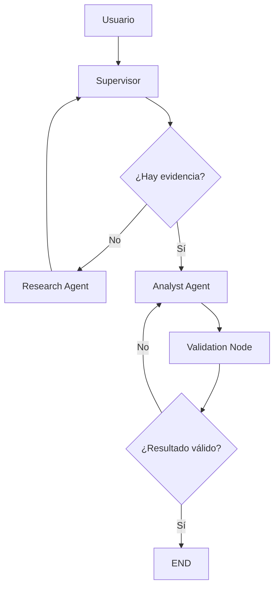

# Orquestador Multi-Agente de Investigación y Análisis

## Topología elegida

Este proyecto implementa una topología jerárquica con un nodo Supervisor central y tres etapas explícitas de coordinación:

- **Agente de Investigación**: recurre al vectorstore Chroma para encontrar evidencia útil.
- **Agente de Análisis**: procesa la evidencia recuperada y genera un resumen válido.
- **Validación**: el Supervisor comprueba que el resultado cumple una regla mínima antes de cerrar.

La idea principal es limitar el contexto compartido a lo necesario y controlar la delegación dinámica con un grafo bien definido.



## Estructura del repositorio

- `state.py`: define el `MessagesState` y los campos de routing (`next_agent`, `step_count`, `validation_status`).
- `supervisor.py`: contiene la lógica del router y la validación del resultado.
- `agents/research_agent.py`: agente especializado en buscar evidencia en el vectorstore.
- `agents/analyst_agent.py`: agente especializado en interpretar la evidencia.
- `graph.py`: define el `StateGraph` y conecta los nodos del sistema.
- `vectorstore_client.py`: cliente para consultar la colección `technical_documents` de Chroma.
- `requirements.txt`: dependencias del proyecto.

## ¿Por qué esta topología?

La topología jerárquica fue elegida porque permite:

1. **Centralizar la coordinación**: el Supervisor decide en cada paso quién debe actuar.
2. **Especializar responsabilidades**: cada agente tiene una tarea acotada.
3. **Controlar bucles**: el contador de pasos y la validación explícita evitan un supervisor infinito.
4. **Reducir contaminación de contexto**: cada nodo recibe solo la información que necesita.

## Manejo de conflictos entre agentes

Para evitar ambigüedades:

- el Supervisor toma la decisión final sobre el siguiente nodo;
- el Agente de Investigación solo genera evidencia documental;
- el Agente de Análisis solo interpreta la evidencia;
- la validación es explícita y no se considera completo un resultado sin criterio mínimo.

## Validación implementada

El sistema no da `END` a la primera. Debe cumplirse una de estas condiciones:

- hay evidencia recuperada;
- el analista produjo un resultado no vacío;
- el análisis fue marcado como válido;
- el supervisor ha verificado la calidad final antes del cierre.

Esto evita aceptar resultados incompletos o parciales.

## Cómo ejecutar

```bash
pip install -r requirements.txt
python graph.py
```

## Demo del flujo

La consulta de ejemplo es:

> ¿Qué dice la documentación sobre Amazon Redshift y su arquitectura?

El flujo real ejecuta esta secuencia:

1. Supervisor detecta que no hay evidencia.
2. Research Agent consulta Chroma.
3. Supervisor recibe los resultados relevantes.
4. Analyst Agent procesa la evidencia.
5. Validation Node valida el análisis.
6. Supervisor cierra el flujo con éxito.

## Nota técnica

Se reutiliza el vectorstore persistido generado en el 3er módulo, que contiene documentos técnicos en Chroma bajo la colección `technical_documents`.
