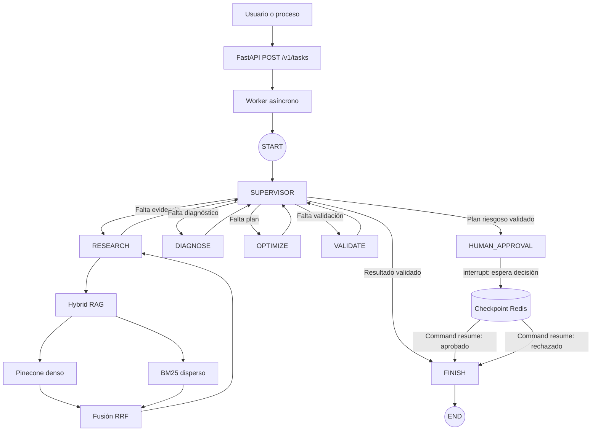
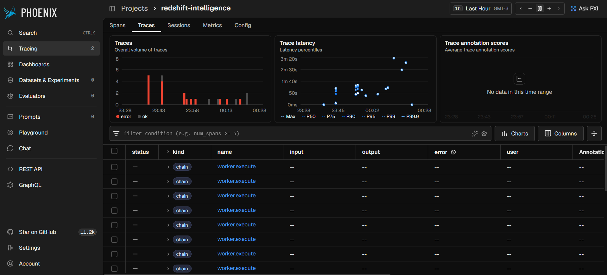
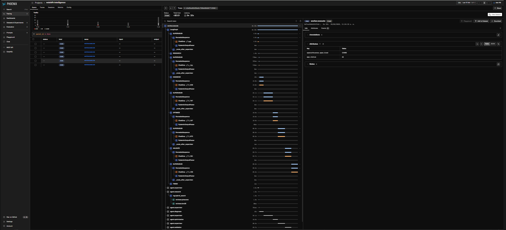
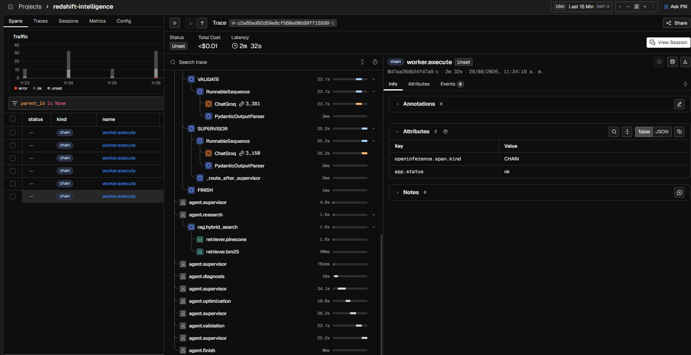
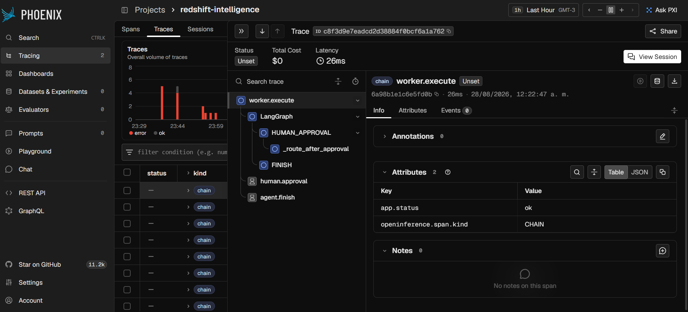
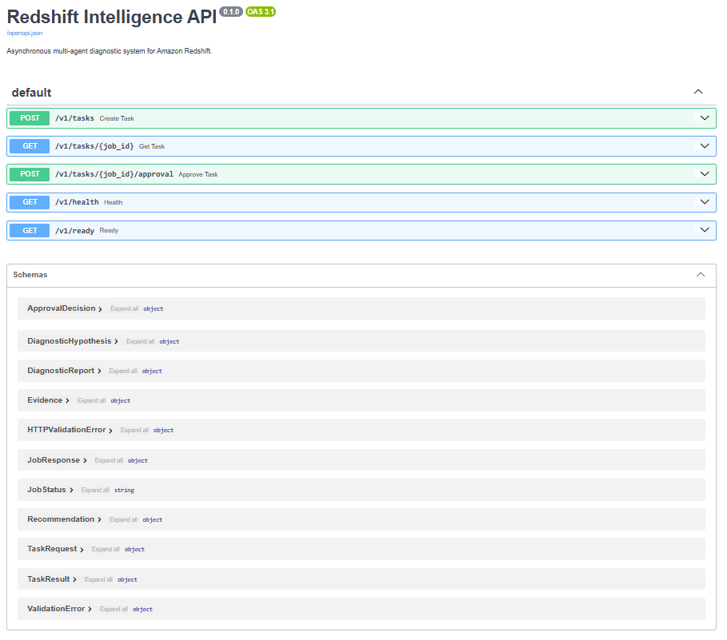

# Redshift Intelligence

Copiloto multiagente para diagnóstico y optimización de Amazon Redshift. Combina
RAG híbrido, coordinación mediante Supervisor, aprobación humana para acciones
críticas, API asíncrona, persistencia y trazabilidad.

## Estado de implementación

- [x] Configuración validada con Pydantic Settings.
- [x] Contratos Pydantic para API, evidencia, diagnóstico y recomendaciones.
- [x] Corpus autocontenido de doce documentos.
- [x] Recuperación BM25 asíncrona sin bloquear el event loop.
- [x] Recuperación densa con el SDK nativo `PineconeAsyncio`.
- [x] Fusión RRF concurrente y deduplicación de evidencia.
- [x] Grafo LangGraph con Supervisor y agentes especializados.
- [x] Checkpointer Redis e interrupciones HITL.
- [x] FastAPI, workers y persistencia de jobs.
- [x] Phoenix, Docker Compose y cinco pruebas end-to-end con evidencia.

## Grafo de agentes implementado

El siguiente diagrama representa el grafo ejecutado por LangGraph; no es una
arquitectura futura ni una descripción conceptual.




El Supervisor propone la siguiente ruta, pero guardas deterministas impiden
finalizar mientras falten evidencia, diagnóstico, recomendaciones o validación.
Todos los nodos comparten el mismo `thread_id`, persistido por el checkpointer de
LangGraph en Redis.

## Desarrollo

Requiere Python 3.12 o superior:

```powershell
python -m venv .venv
.venv\Scripts\Activate.ps1
pip install -e ".[dev]"
Copy-Item .env.example .env
pytest -q
```

No copies claves desde los módulos anteriores. Configura secretos nuevos en
`Proyecto_Final/.env`, que no debe versionarse.

## Inicio con un solo comando

1. Copiar `.env.example` a `.env` y completar `PINECONE_API_KEY` y
   `GROQ_API_KEY`. El namespace debe coincidir con el corpus indexado.
2. Ejecutar:

```powershell
docker compose up --build
```

Servicios disponibles:

- Swagger/OpenAPI: <http://127.0.0.1:8000/docs>
- Phoenix: <http://127.0.0.1:6006>
- Redis: `127.0.0.1:6379`

Si `localhost` está configurado correctamente también funciona, pero se documenta
`127.0.0.1` para evitar problemas de resolución IPv4/IPv6 en Windows.

La API usa un proceso Uvicorn porque la cola de trabajos vive dentro del proceso.
Redis conserva jobs y checkpoints. Para escalar horizontalmente se debe reemplazar
la cola local por ARQ, Celery u otro broker distribuido.

## Decisiones iniciales

- El dominio depende de protocolos, no de FastAPI, LangGraph o Pinecone.
- Pinecone usa su cliente asyncio nativo y context managers para cerrar sesiones.
- BM25, que es CPU-bound, se ejecuta mediante `asyncio.to_thread`.
- Las recomendaciones de riesgo alto o crítico requieren aprobación por contrato.
- Una validación fallida no puede dirigir el flujo a finalización.

## API

- `POST /v1/tasks`: valida, persiste y encola una tarea; responde `202`.
- `GET /v1/tasks/{job_id}`: consulta el estado y el resultado tipado.
- `POST /v1/tasks/{job_id}/approval`: aprueba o rechaza una pausa HITL.
- `GET /v1/health`: comprueba Redis.
- `GET /v1/ready`: comprueba que los workers estén inicializados.

Crear y consultar una tarea:

```powershell
$job = Invoke-RestMethod -Method Post http://127.0.0.1:8000/v1/tasks `
  -ContentType 'application/json' `
  -Body '{"query":"Diagnostica una consulta con queue time elevado"}'

Invoke-RestMethod "http://127.0.0.1:8000/v1/tasks/$($job.id)"
```

Reanudar una tarea en `WAITING_APPROVAL`:

```powershell
Invoke-RestMethod -Method Post `
  "http://127.0.0.1:8000/v1/tasks/$($job.id)/approval" `
  -ContentType 'application/json' `
  -Body '{"approved":true,"comment":"Revisado por operaciones"}'
```

## Pruebas y evidencia

Pruebas locales:

```powershell
pytest -q
```

Cinco ejecuciones end-to-end contra el sistema completo:

```powershell
python load_test.py
```

El runner admite `--concurrency 1..5`. El valor predeterminado es 1 para respetar
cuotas gratuitas de tokens por minuto; puede aumentarse cuando el proveedor lo
permita sin modificar el sistema.

En Phoenix seleccionar el proyecto `redshift-intelligence` y comprobar los spans
`worker.execute`, `agent.supervisor`, `agent.research`, `retriever.pinecone`,
`retriever.bm25`, `agent.diagnosis`, `agent.optimization` y `agent.validation`.
Las capturas requeridas se describen en [`evidence/README.md`](evidence/README.md).
El lote final reproducible está en
[`evidence/load-test-report.json`](evidence/load-test-report.json) y su análisis en
[`evidence/observability-report.md`](evidence/observability-report.md).

Phoenix registra el árbol completo de spans, latencia, tokens y costo estimado de
las llamadas al LLM. La evidencia final incluyó 725 spans y 23 trazas acumuladas,
con spans específicos para Supervisor, agentes, Pinecone, BM25, HITL y workers.

## Evidencia visual

Todas las imágenes corresponden a ejecuciones reales del sistema local y están
versionadas en [`evidence/`](evidence/).

### Trazas del sistema

Vista general del proyecto `redshift-intelligence` en Arize Phoenix:



> **Nota sobre los errores visibles:** esta vista general conserva ejecuciones de
> estabilización afectadas por límites de cuota y validaciones de modelos externos.
> Se incluyen deliberadamente porque demuestran que Phoenix captura recorridos
> exitosos y fallos con su latencia y causa. Las siguientes capturas corresponden
> a ejecuciones finales correctas del grafo, el RAG híbrido y la aprobación humana.

### Supervisor y agentes especializados

Árbol de ejecución con Supervisor, Research, Diagnosis, Optimization y sus
transiciones dentro de LangGraph:



### Recuperación híbrida: Pinecone y BM25

El span `rag.hybrid_search` ejecuta los retrievers `retriever.pinecone` y
`retriever.bm25`. Sus resultados se combinan mediante Reciprocal Rank Fusion:



### Aprobación humana y reanudación

La traza muestra la reanudación persistida desde `HUMAN_APPROVAL` hasta `FINISH`:



### API profesional documentada

FastAPI publica contratos de entrada y salida validados con Pydantic mediante
OpenAPI/Swagger:



## Persistencia y recuperación

Cada job usa su `thread_id` como identificador del checkpoint de LangGraph. Al
reiniciar, los jobs `PENDING` y `RUNNING` se vuelven a encolar. Los jobs
`WAITING_APPROVAL` permanecen pausados hasta recibir una decisión. Los registros
de jobs expiran después de siete días por defecto; los checkpoints requieren una
política de retención operativa explícita.

## Seguridad

- No se versionan secretos ni respuestas completas en variables de entorno.
- La API nunca devuelve el registro interno que contiene la solicitud persistida.
- Las recomendaciones `high` o `critical` requieren aprobación por contrato.
- La aprobación reanuda el mismo thread; el rechazo deja el job en `REJECTED`.
- En una exposición fuera de localhost deben agregarse autenticación, autorización,
  TLS, rate limiting y políticas de red.
